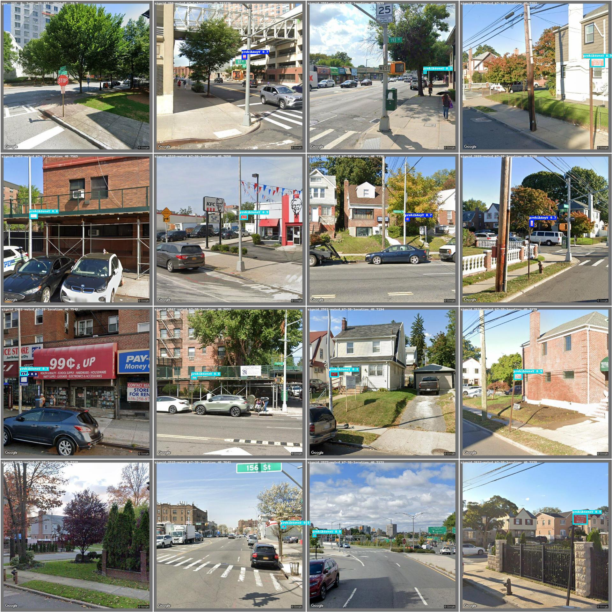
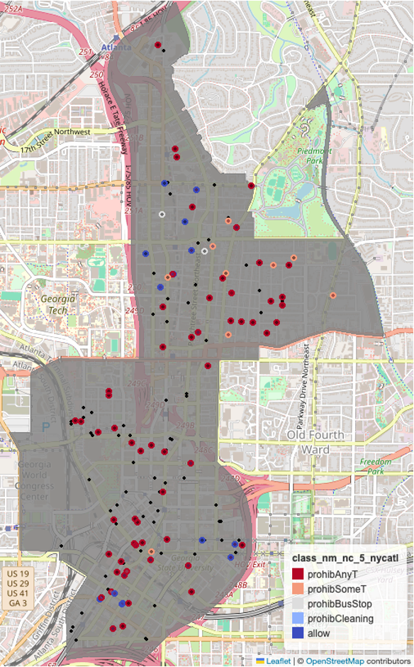

# **Parking Sign Detection using GSV Images and Computer Vision Models**

This project presents an **automatic parking sign detection method** using **Google Street View (GSV) images** and **computer vision (CV) models**.

## **Motivation**
Many cities in the US do not maintain updated street parking location data due to the high cost of manual recording and inventory updates. To address this, we leverage existing parking sign inventories to assist in parking sign detection across different cities.

## **Project Overview**
Our demonstration involves:
- Using **New York City’s parking sign images** to train an **object detection model**.
- Applying the trained model on **Atlanta, Georgia’s** parking sign images.
- Ensuring **generalizability** by using **GSV images** for both training and inference.

This project is part of the broader **"Complete Street" Index** research initiative at [the Center for Urban Resilience and Analytics](https://resilience.research.gatech.edu/) at **Georgia Tech**.

## **Methods**
This repository includes the following key methods:

1. **GSV Image Retrieval**  
   - Extracting GSV images using **parking sign location data** from the [NYC Open Data Portal](https://data.cityofnewyork.us/Transportation/Parking-Regulation-Locations-and-Signs/xswq-wnv9/about_data).

2. **Object Detection Model Training**  
   - Training a **YOLO (v11)** object detection model on NYC parking sign images.

3. **Inference on Atlanta GSV Images**  
   - Applying the trained model to detect parking signs in Atlanta.
   

4. **Visualization**   
   - Geographical distribution of detected parking signs in Atlanta (n=167).  
   
---