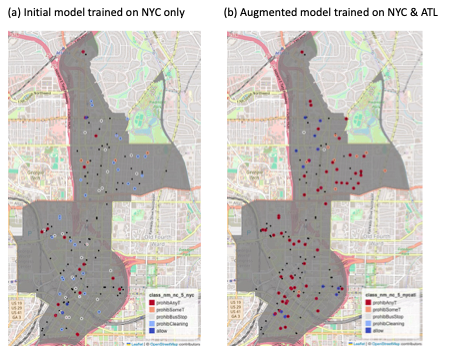

# Parking Sign Detection using GSV Images and CV Models

This project proposes an automatic parking sign detection method using Google Street View (GSV) images and computer vision (CV) models. Many cities in the US do not maintain street parking location information in part due to the high cost of manual recording and updating inventories. To help address this issue, we leverage existing assets of parking sign inventories to facilitate parking sign detections in other cities. Our demonstration includes using New York City's parking sign images to train an object detection model and applying the model on Atlanta, Georgia, parking sign images. Throughout our workflow, we use GSV images for both model training and inference to ensure that our method can be generalizable to different cities in the US.

This project is part of a broader research project developing "Complete Street" Index at [the Center for Urban Resilience and Analytics](https://resilience.research.gatech.edu/) at Georgia Tech. 

Methods in this repository include:
1. GSV image retrieval using the parking sign location data available at [NYC Open Data Portal](https://data.cityofnewyork.us/Transportation/Parking-Regulation-Locations-and-Signs/xswq-wnv9/about_data)

2. YOLO (v. 11) object detection model training

3. Inference on Atlanta GSV images

4. Visualization 

